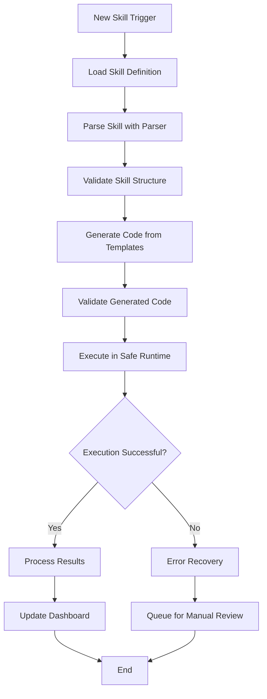

# Silver Tier Architecture: Dynamic Skill Execution System

## Overview
The Silver tier architecture transforms your AI Employee system from static scripts to a dynamic, skill-based system where Claude reads skill definitions and generates/executes logic dynamically.

## Architecture Components

### 1. Skill Definition Layer
- **Purpose**: Store business logic in human-readable markdown files
- **Files**: `email_handler.md`, `inbox_processor.md`, `approval_checker.md`, etc.
- **Format**: Structured markdown with standardized sections
- **Content**: Triggers, conditions, actions, templates, decision matrices

### 2. Skill Parser
- **Purpose**: Convert markdown skill definitions to structured data
- **Function**: Extract triggers, actions, templates, and logic
- **Output**: JSON structure representing the skill logic
- **Validation**: Ensures skill definition completeness

### 3. Code Generator
- **Purpose**: Convert structured skill data to executable code
- **Function**: Generate Python/JavaScript functions from skill definitions
- **Templates**: Pre-built code templates for common patterns
- **Safety**: Injects safety wrappers and validation

### 4. Runtime System
- **Purpose**: Execute generated code safely
- **Function**: Sandboxed execution with monitoring
- **Security**: Resource limits and access controls
- **Recovery**: Error handling and fallback mechanisms

### 5. Validation System
- **Purpose**: Ensure code safety and correctness
- **Function**: Syntax, security, and semantic validation
- **Controls**: Security scanning and resource limits
- **Recovery**: Error handling and fallback procedures

## Execution Flow

### Dynamic Skill Execution Process


### 1. Skill Loading Phase
```python
def load_and_execute_skill(skill_name, input_data):
    # Load skill definition from markdown
    skill_def = load_skill_definition(skill_name)

    # Parse the skill into structured data
    parsed_skill = parse_skill(skill_def)

    # Validate the skill structure
    if not validate_skill_structure(parsed_skill):
        raise ValidationError("Invalid skill structure")

    return parsed_skill
```

### 2. Code Generation Phase
```python
def generate_and_validate_code(parsed_skill, input_data):
    # Generate code from skill templates
    generated_code = generate_code_from_skill(parsed_skill)

    # Validate the generated code
    validation_results = validate_generated_code(generated_code, parsed_skill)

    if not validation_results['overall_valid']:
        raise ValidationError(f"Code validation failed: {validation_results['errors']}")

    return generated_code
```

### 3. Execution Phase
```python
def execute_skill_code(generated_code, input_data):
    # Prepare execution environment
    prepared_code = prepare_code_for_execution(generated_code)
    sandbox_env = setup_sandbox_environment()

    # Execute in safe runtime
    execution_result = execute_in_sandbox(prepared_code, sandbox_env, input_data)

    # Process and validate results
    processed_result = process_execution_result(execution_result)

    return processed_result
```

## Key Benefits

### Flexibility
- Update business logic by editing markdown files
- No code deployment needed for logic changes
- Easy experimentation with new workflows
- Rapid iteration on business rules

### Safety
- Comprehensive validation at every step
- Sandboxed execution environment
- Resource usage monitoring
- Security scanning of generated code

### Maintainability
- Human-readable skill definitions
- Centralized business logic
- Clear separation of concerns
- Standardized templates

### Scalability
- Dynamic code generation
- Reusable skill components
- Parallel execution capability
- Resource-efficient operation

## Implementation Roadmap

### Phase 1: Foundation
- [ ] Deploy skill parser
- [ ] Implement basic code generator
- [ ] Create safe runtime environment
- [ ] Develop validation framework

### Phase 2: Integration
- [ ] Connect skills to existing system
- [ ] Implement dashboard updates
- [ ] Add error recovery mechanisms
- [ ] Create monitoring dashboards

### Phase 3: Optimization
- [ ] Add caching mechanisms
- [ ] Implement performance monitoring
- [ ] Optimize code generation speed
- [ ] Enhance security controls

## Security Considerations

### Multi-layer Security
1. **Skill Definition**: Input validation for markdown files
2. **Parsing**: Sanitization of extracted data
3. **Generation**: Safe template instantiation
4. **Validation**: Comprehensive security scanning
5. **Execution**: Sandboxed runtime with limits

### Access Controls
- Limited file system access (vault only)
- No system command execution
- Restricted network access
- Controlled resource usage

## Performance Optimization

### Caching Strategy
- Cache validated skill definitions
- Reuse compiled code objects
- Store frequently used templates
- Optimize parsing performance

### Resource Management
- Memory usage limits
- Execution time constraints
- File operation quotas
- Concurrent execution controls

## Migration Strategy

### From Bronze to Silver Tier
1. **Keep existing scripts** as fallback
2. **Deploy skill parser** alongside current system
3. **Gradually migrate** skills one by one
4. **Monitor performance** and stability
5. **Switch over** completely when ready

This Silver tier architecture provides a robust foundation for dynamic skill execution while maintaining security, performance, and reliability.